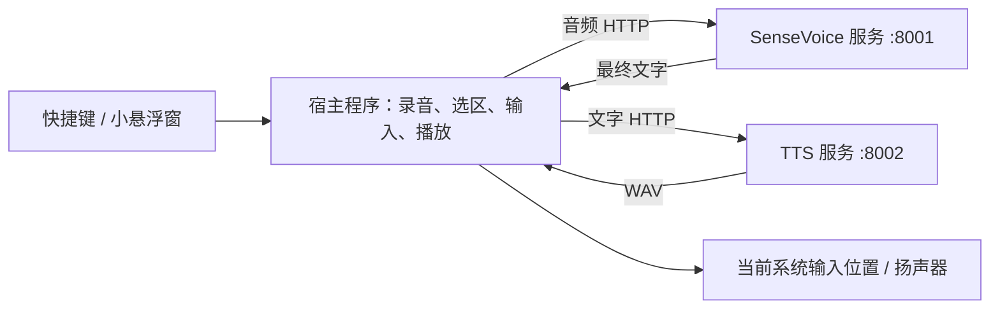

# 本地语音悬浮工具：初版设计

状态：2026-09-06 已按用户选择实现 Windows Rust + Slint 初版，暂不考虑跨平台。实际操作、验证与限制以 [客户端说明](../desktop/README.md) 为准。本文保留最初方案比较；下述其他平台内容仅为后续参考。

## 选择

已使用 **Rust + Slint**：一个宿主进程，原生绘制的小窗口，直接调用现有 HTTP 语音服务。Slint UI 使用自己的声明式语法；业务与系统交互使用 Rust。当前只实现 Windows。

如果 TypeScript 的优先级高于最小运行开销，可用 **TypeScript + Slint Node.js 绑定**。同样不需要 WebView，但要携带 Node.js，并通过原生模块完成系统交互；因此它不是全部用 TypeScript 就能完成的方案。最终占用需要测量包含音频和系统桥接的发布包。

PocketJS 可用于探索，但暂不作为本项目默认底座。它使用 QuickJS 与原生渲染，已有透明置顶窗口示例；核对的平台注册表有 macOS 和 Linux 桌面目标，但没有 Windows 10/11 目标。它的 UI 输入能力也不能直接等同于向其他应用输入文字、读取其他应用的选区。若采用，需要先补齐并验证这些宿主能力。宣传的 8 MB 是 PSP 样例；官方桌面编辑器自测为 Apple M3 Max 上约 83 MB，不能据此预测本工具在 Windows 上的占用。

Tauri 是保留 Web 前端开发方式的备选，仍然使用系统 WebView，不符合严格的无 WebView 要求。

## 运行边界

- Windows 宿主访问专用 LocalVoice WSL 的本机端口。麦克风、扬声器、快捷键和其他应用交互都在 Windows 端处理。
- macOS、Linux 客户端使用相同 HTTP 协议，模型服务在对应本机环境独立部署；WSL 只是当前 Windows 的部署方式。
- 复用两个现有服务，不增加网关进程。默认仅连接本机回环地址；远程部署不属于初版范围。
- UI 从服务获取音色列表。当前后端仍是 Kokoro，之前讨论的普通话音色升级单独替换 TTS 实现，不影响录音和系统输入逻辑。
- 使用优先级为日常听写优先、偶尔朗读。保持轻量 TTS，不为克隆或情绪控制增加常驻模型；音色升级先比较同规模的普通话方案。
- 宿主启动时检查健康状态；Windows 可复用现有 LocalVoice 启动入口。关闭窗口只收起；显式退出释放录音、播放及快捷键。模型服务仍由现有启动/停止入口管理。

## 两个操作

### 说话输入

1. 用户将光标放到目标输入框，按可配置的全局快捷键，默认候选为 `Ctrl+Alt+Space`。注册冲突时显示提示并允许更换。
2. 先记录前台窗口与可识别的焦点控件，再开始录音并显示不激活、不抢焦点的悬浮条。开始录音会停止正在播放的 TTS。
3. 本机轻量 VAD 判断停顿。初始静音阈值约 700 ms，保留短预录缓冲防止切掉首音；无语音不发请求。每段最长约 25 秒，保留服务的 30 秒上限余量。
4. 一段话结束后上传保留设备采样率的单声道 WAV，由服务重采样到 16 kHz，取得最终识别结果，再在目标输入位置插入。这是按句提交，不是逐字流式识别，也不回删已输入内容。
5. 每次提交前复核目标。录音期间检测到焦点离开原目标就暂停自动提交，待处理文字只留在内存，提示用户重新选定位置并主动插入或复制。不能可靠识别控件时采用保守的手动提交。系统输入接口无法提供跨应用的原子焦点锁定，快速切换窗口仍须实测。
6. 再按快捷键停止采集并提交尾段；取消操作丢弃未提交尾段。不会自动按 Enter 或提交表单。密码控件可识别时禁用自动输入。

ASR 请求保持顺序、单路执行，只允许少量待处理片段。服务跟不上时暂停采集并提示，避免无限积压或悄悄漏字。

### 选中文字朗读

1. 用户选中文字后按第二个快捷键，默认候选为 `Ctrl+Alt+R`。
2. 只在触发时读取选区。优先用系统辅助功能接口，不读取整个页面或后台持续监控选区。
3. 不支持读取选区的应用，初版提示用户复制后使用“朗读剪贴板”。自动模拟复制可作为后续可选兼容项，不作为默认机制，以避免覆盖原剪贴板和引入恢复竞态。
4. 文本按句拆分，每段最多 180 字符；太长的单句在标点或安全字符边界切分。先合成第一段并播放，再串行合成后续段，当前没有预取。
5. 再按朗读快捷键或点停止，立即停止本机播放并清空队列。每次任务带代次标识，旧请求返回后直接丢弃，不能重新开始播放。

当前 TTS 返回完整 WAV，所以初版是分句播放；取消 HTTP 等待不能保证终止服务端正在进行的模型计算。连续两次任务可能短暂遇到忙碌状态，客户端应提示等待并有界重试。

## 窗口与代码规模

当前为 380 × 102 逻辑像素的悬浮条，有待复制文字时增高，可拖动、置顶、收起到托盘；显示当前状态、录音/停止与朗读操作。无操作时不播放循环动画。设置窗口可以正常获得焦点，状态悬浮条不获得键盘焦点。

设置只保留两个快捷键、麦克风、音色/语速、服务地址。输出使用 Windows 默认设备。使用一个配置文件；音频和文字默认仅在任务内存中暂存，不建立历史记录。

实现保持四个小模块：

- UI：悬浮条、托盘、设置与状态显示。
- 操作控制：录音分段、识别提交、朗读队列和取消。
- 服务客户端：健康检查、识别、音色列表、语音合成。
- 平台适配：快捷键、不抢焦点窗口、目标校验、读取选区、插入文字；按 Windows/macOS/Linux 分文件实现。

使用系统登记的全局快捷键，而非收集所有按键。初版不实现系统输入法、DLL 注入、应用专用插件或常驻管理员进程。

## 平台边界与验证

Windows 使用系统快捷键登记、UI Automation 读取可用选区与焦点、Unicode 键盘输入提交文字。普通权限进程不能通过 SendInput 向更高权限应用输入；保留手动复制降级，不自动提权。部分自绘控件、终端与应用可能需要不同兼容路径，实际支持列表以测试为准。

macOS 需要麦克风与辅助功能授权。Linux 的 X11 和 Wayland 分开处理：Wayland 的全局快捷键、跨应用输入与选区能力取决于 portal 和桌面环境，不能承诺所有发行版完全一致。跨平台窗口框架不能消除这些系统差异。

先验证 Windows 上的记事本、浏览器输入框、编辑器和日常聊天应用：

- 录音快捷键与点击悬浮条均不抢目标焦点；中文、英文、混排按句正确插入。
- 识别尚未返回时切换窗口，不向新应用误输；取消后旧请求不会插入或播放。
- 可读取的选区正确朗读；不可读取的应用清晰提示复制降级；原剪贴板不被自动改写。
- 拔掉麦克风、服务未启动、429、断连、长句和连续操作都有明确状态，队列有界。
- 多显示器和缩放下窗口位置正常；退出后快捷键与音频设备释放。
- 发布版已实测宿主空闲工作集 31.24 MiB、整机 CPU 约 0.14%（10 秒采样），详见客户端说明。模型服务资源另计；实际麦克风端到端延迟与日常应用兼容性仍待使用验证。

## 已有接口

| 接口 | 当前行为 |
|---|---|
| `POST :8001/v1/audio/transcriptions` | multipart 音频与 language，返回最终文字；单段 ≤30 秒、文件 ≤20 MB |
| `POST :8002/v1/audio/speech` | input、voice、speed 等 JSON 参数；返回完整 WAV；input ≤2000 字符 |
| `GET :8002/v1/audio/voices` | 当前音色列表 |
| `GET :8001/health`、`GET :8002/health` | 服务就绪状态 |

## 官方参考

- [PocketJS 架构、示例与自测](https://github.com/pocket-stack/pocketjs)
- [PocketJS 实际平台注册表](https://github.com/pocket-stack/pocketjs/blob/main/contracts/spec/platforms.ts)
- [Slint 桌面平台](https://docs.slint.dev/latest/docs/slint/guide/platforms/desktop/)
- [Slint 语言绑定](https://slint.dev/faqs)
- [Slint 1.17：Node.js 事件循环改进及 Windows 待优化项](https://slint.dev/blog/slint-1.17-released)
- [Tauri 使用的 WebView](https://v2.tauri.app/reference/webview-versions/)
- [Windows RegisterHotKey](https://learn.microsoft.com/en-us/windows/win32/api/winuser/nf-winuser-registerhotkey)
- [Windows SendInput 及权限边界](https://learn.microsoft.com/en-us/windows/win32/api/winuser/nf-winuser-sendinput)
- [macOS 选区属性](https://developer.apple.com/documentation/applicationservices/kaxselectedtextattribute)
- [Wayland 全局快捷键 portal](https://github.com/flatpak/xdg-desktop-portal/blob/main/data/org.freedesktop.portal.GlobalShortcuts.xml)
- [输入控制 portal](https://flatpak.github.io/xdg-desktop-portal/docs/doc-org.freedesktop.portal.RemoteDesktop.html)
